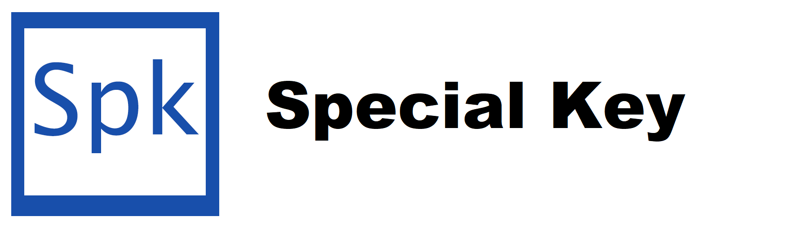

Special key is a dynamic, fast and object-oriented programming language for buinding versatile and fast applications!

It is in heavy develpoment now, but ready to try out!
## Installation
### Building from source
First install Java JDK.

You can clone this repository and create new project Your IDE.

`
git clone https://github.com/TiM-SyStEm/Special-Key-SPS spk
`
#
### By .jar
You also can open SPK Shell by running compiler.jar in the src folder
#
## Contribution
Special Key is open-source project. Almost all pull requests will be considered!

## License
Special key is relseased under <a href="https://en.wikipedia.org/wiki/Apache_License">Apache license 2.0</a>

See more about it!

## Roadmap
Our small roadmap
* Add classes
* optimization
* Redesign site
* Add modules from cwd
* WSGforms
## Usage
Special Key shell provides you some functions to run code

`comp [path_to_file]` - compile and run file
Example of usage:

`$>comp main`

`$>comp main.spk`

Notice that extension of file is not required

`cls` - clears the screen

<h1 align="middle" style="font-size: 72px;">WE 💖⚙️ SPECIAL KEY</h1>
